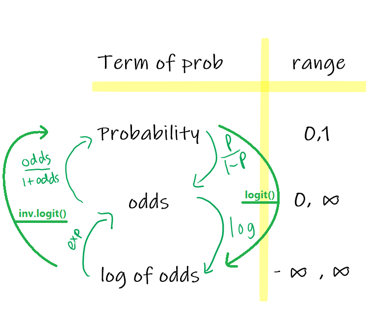

```{r setup, include=FALSE}
# clear-up the environment
rm(list = ls())

# chunk options
knitr::opts_chunk$set(
  message = FALSE,
  warning = FALSE,
  fig.align = "center",
  comment = "#>"
)

options(scipen = 10)
```

# Classification in Machine Learning 1 {.tabset}

## Course Map

```{r, echo=FALSE}
knitr::include_graphics("assets/Classification 1.png")
```

## Classification Concept

Dalam machine learning dan statistik, **classification** / klasifikasi adalah bentuk pendekatan supervised learning untuk memprediksi **label** dari suatu target variabel bertipe **kategorikal**

**Contoh prediksi:**

- Spam/no spam?
- Loan default/no default?
- Customer churn/loyal
- Yes/No?
- ...
- 1/0 (Positive/Negative)

Terdapat 2 jenis tipe algoritma klasifikasi:

- Binary: ketika `y` adalah biner (1 untuk spam, 0 untuk bukan-spam)
- Multiclass: ketika `y` > 2 kategori

## Library Preparation

Berikut beberapa library yang digunakan selama pemodelan klasifikasi

```{r echo=TRUE, warning=FALSE}
library(dplyr) # for wrangling
library(inspectdf) # for EDA
library(gtools) # for ML model & assumption 
library(caret) # for ML model & evaluation 
library(readxl)
```

# Binary Classification using Logistic Regression - Workflow

Tujuan dari logistic regression adalah menggunakan model regresi linier untuk memprediksi probability (yang dapat digunakan untuk klasifikasi).

Linear Regression vs Logistic Regression

```{r, echo=FALSE}
knitr::include_graphics("img/lin_reg_vs_log_reg.png")
```

Ide dari logistic regression mulanya berangkat dari model linear regression. Bedanya:  
- **Linear regression:** digunakan untuk memprediksi angka kontinu
- **Logistic regression:** digunakan untuk memprediksi probability

- Range regression: -Inf s/d Inf
- Range probability: 0 s/d 1

Berikut adalah workflow yang biasa digunakan pada pemodelan Klasifikasi

1. Problem Statement
2. Read Data + Data Understanding
3. Data Wrangling
4. EDA
5. Cross Validation
6. Build Model & Interpretation
7. Model Selection & Assumption
8. Predict
9. Model Evaluation

## Problem Statement

Pemanfaatan data analitik untuk pengembangan kasus kredit dan perbankan telah meningkatkan dan merevolusi pengambilan keputusan oleh departemen kredit guna menambah efisiensi dalam pengambilan kebijakan. Pemanfaatan bidang analitik telah digunakan selama bertahun-tahun. Namun, karena sistem yang dimiliki oleh perbankan itu sendiri bersifat dinamis, pengumpulan, pemrosesan dan analisa terhadap data yang digunakan sebagian besar bersifat manual. Pendekatan yang bersifat manual ini memberikan kesulitan tersendiri untuk tim. Untuk mengatasi permasalahan ini, dibutuhkan suatu metode yang bersifat cepat dan dinamis dan mampu memanfaatkan informasi yang dimiliki secara optimal. Metode Machine Learning menjadi salah satu jawaban untuk mengatasi problem tersebut.

**Behaviour Analysis** dalam konteks kartu kredit merujuk pada metode evaluasi perilaku keuangan dan pembayaran seorang individu atau peminjam. Prediksi klasifikasi ini dapat memberikan gambaran tentang kecenderungan seorang peminjam untuk membayar tepat waktu atau mungkin memiliki riwayat pembayaran yang kurang konsisten.

Kita akan membuat pemodelan machine learning untuk memprediksi suatu debitur gagal/berhasil bayar pada suatu dataset dari Bank di Taiwan.

📍 Dengan asumsi perusahaan kredit sudah memiliki market share yang baik, **tujuan** dari analisis prediktif ini adalah untuk **mengurangi debitur yang diprediksi berhasil bayar padahal aktualnya gagal bayar**

## Read Data 

Kita akan mencoba untuk membaca data dengan format excel. Di R, kita bisa gunakan syntax berikut: `read_xlsx("lokasi working directory")` dari `library(readxl)` dari data 

```{r}
# read data
data <- read_xlsx("data/credit_taiwan.xlsx")
head(data)
```

Dataset memiliki 25 kolom dan 30,952 dengan penjelasan sebagai berikut:

- `id`        = id debitur
- `limit_bal` = Besaran kredit limit yang diberikan dalam dolar NT
- `sex`       = jenis kelamin 
    - man = laki-laki -> 1
    - woman = perempuan -> 2
- `education` = Pendidikan terakhir 
    - postgraduate (s2 & s3) -> 1
    - undergraduate (s1) -> 2
    - highschool (SMA) -> 3
    - others = lain-lain -> 4
- `marriage`  = Status pernikahan 
    - unknown = tidak terdapat status -> 0
    - married = menikah -> 1
    - single = lajang -> 2
    - others = lainnya -> 3
- `age` = Usia dalam tahun
- `pay_*` = Status pembayaran dalam bulan April (1) - September (6).
    - 0 = pembayaran tepat waktu
    - 1 = keterlambatan pembayaran satu bulan
    - 2 = keterlambatan pembayaran dua bulan
    - ...
    - 8 = keterlambatan pembayaran delapan bulan atau lebih
- `bill_amt*` = Jumlah tagihan pada bulan April (1) - September (6) dalam dolar NT 
- `pay_amt*`  = Jumlah pembayaran/pengeluaran sebelumnya pada bulan April (1) - September(6) dalam dolar NT
- `gb_flag` = Flagging pembayaran default (gagal bayar) pada bulan berikutnya 
    - 1 = default
    - 0 = not default

## Data Wrangling 

1. Melakukan seleksi dan drop kolom yang tidak dipakai

📍 Drop kolom `id` yang mana hanya sebagai identifier debitur dan tidak akan dipakai ke dalam pemodelan

```{r}
# your code here
data_clean <- data %>% 
  select(-id)
head(data_clean)
```

2. Melakukan perubahan tipe data

```{r}
# cek struktur data
str(data_clean)
```


❓ Manakah diantara tipe-tipe data di atas yang perlu dilakukan konversi?

- sex
- marriage
- education
- gb_flag

```{r}
data_clean <- data_clean %>% 
  mutate(
    sex = as.factor(sex),
    marriage = as.factor(marriage),
    education = as.factor(education),
    gb_flag = as.factor(gb_flag)
  )

glimpse(data_clean)
```

## Exploratory Data Analysis (EDA)

Pada tahapan EDA kita ingin mengetahui bagaimana sebaran data kategorik maupun numerik. 

- `inspect_cat()` untuk melihat summary/ringkasan nilai untuk variabel kategorik. 
- `inspect_num()` untuk melihat summary/ringkasan nilai untuk variabel numerik.
- [optional] `show_plot()` untuk menampilkan plot sederhana dari fungsi `inspect_*`

```{r}
# your code here
data_clean %>% 
  inspect_cat()
```

💡 **Insight:**

- Debitur yang paling banyak adalah perempuan, yaitu sekitar 59%
- Sekitar 53% dari debitur, tidak mengalami gagal bayar 

```{r}
data_clean %>% 
  inspect_num()
```
💡 **Insight:**

- Rentang nilai usia ada di 21 - 75, dimana 21 adalah debitur termuda dan 75 adalah debitur paling senior (tua)
- Rata-rata usia para debitur adalah 35 tahun

## Cross Validation

Cross Validation adalah metode yang digunakan untuk memisahkan data menjadi 2 bagian yaitu data train dan data test.

- Data yang digunakan untuk melatih model kita sebut dengan `data train`, sedangkan
- Data yang digunakan untuk menguji model disebut dengan `data test`.

```{r echo=FALSE}
knitr::include_graphics("img/test-train.png")
```

 **Analogi sederhana**

- Seorang siswa dapat dikatakan pintar ketika dapat menjawab benar soal-soal ujian yang tidak pernah dikerjakannya pada soal-soal latihan untuk persiapan ujian.
- Data `train` diibaratkan soal latihan, dan data `test` diibaratkan soal ujian. Adapun `model` kita diibaratkan sebagai siswa.

💬 Mengapa kita butuh melakukan cross validation dalam melakukan pembuatan model Machine Learning?

> Untuk mengetahui seberapa baik model untuk memprediksi unseen data dan tidak hanya menghafal data yang ada

Fungsi `initial_split()` dari library `rsample` memiliki beberapa parameter:

- `data` = data frame awal
- `prop` = proporsi dari data yang akan digunakan sebagai data train

Selanjutnya, fungsi `training()` and `testing()` dilakukan untuk mengekstrak data train dan test dari hasil split. 

```{r}
library(rsample)
# intuisi set seed: mengunci kerandoman data
RNGkind(sample.kind = "Rounding")
set.seed(123)

# membuat binary split data menjadi set data training dan testing dengan proporsi 80:20
splitter <- initial_split(data = data_clean, prop = 0.8)

# splitting
train <- training(splitter) #80% dari data
test <- testing(splitter) #20% dari data
```

### Cek Imbalance Class

Proporsi kelas yang balance penting untuk **data train** karena kita akan melatih model menggunakan data train.

Proporsi yang seimbang penting agar model klasifikasi mempelajari karakteristik setiap kelas secara seimbang, tidak dominan hanya satu kelas saja. Hal ini mencegah model bias terhadap kelas yang lebih besar proporsinya sehingga *hanya baik untuk memprediksi 1 kelas saja*.

```{r}
# your code here
table(train$gb_flag) %>% 
  prop.table()
```
💡**Insight:**

- Kelas target balance/tidak? balace
- Tidak balance apabila proporsi 70:30, 80:20 
- Untuk data test tidak perlu dilakukan pengecekan balance/tidaknya variable target. Krn kita akan membiarkan data test apa adanya.

Note: data test tidak masalah bila imbalance, karena berarti tetap mempertahankan proporsi seoriginal mungkin.

## Modelling 

### Theory - Logistic Regression

> Linear Regression : 
  + 300jt, 200jt, dst
  
> Logistic Regression : 
  + Rentang nilai 0-1
  + 0.75, 0.6, 0.4
  
```{r}
train$gb_flag %>% 
  head()
```


#### Probability

Pada dasarnya, ketika kita melakukan klasifikasi maka kita akan menghitung **peluang**. 

$$P(yes) = \frac{n(yes)}{n(yes) + n(no)}$$

📍 Pada pemodelan logistic regression, salah satu hasil prediksi adalah berbentuk **peluang**

**📚 Case Study:**

Saat libur panjang Idul Fitri 2024, terdapat 100 penerbangan di Soekarno-Hatta Airport. Dari 100 penerbangan tersebut, terdapat 20 penerbangan delay. Berapakah probability suatu penerbangan delay di Soekarno Hatta?

```{r}
p_delay <- 20/100
p_delay
```

Peluang penerbangan tidak delay (ontime)

```{r}
p_ontime <- 80/100
p_ontime
```

> Range nilai dari probability = 0 s.d 1

#### Odds 

Odds adalah **peluang kejadian terjadi dibagi dengan peluang kejadian tidak terjadi**.

$$Odds(yes) = \frac{P(yes)}{1-P(yes)}$$

📍 Pada pemodelan logistic regression, **odds** biasanya digunakan untuk interpretasi model.

Sekarang, berapakah odds dari penerbangan ontime?

```{r}
odds_ontime <- 0.8/0.2
odds_ontime
```

**Interpetasi**: Kemungkinan suatu penerbangan di Soetta ontime adalah sebesar **4 KALI** lebih mungkin dibandingkan delay

Lalu, bagaimana dengan odds dari penerbangan delay?

```{r}
odds_delay <- 0.2/0.8
odds_delay
```

**Interpetasi**: Kemungkinan suatu penerbangan delay adalah sebesar **0.25 KALI** lebih mungkin dibandingkan ontime

📌 Notes:

  - Odds = 1 -> sama besar kemungkinannya
  - Odds < 1 -> lebih tidak mungkin
  - Odds > 1 -> lebih besar / mungkin

> Range nilai dari odds = 0 s.d inf

#### Log of Odds

Log of odds adalah nilai odds yang dilogaritmikkan 

$$log(odds_{yes}) = log(\frac{P(yes)}{1-P(yes)})$$

📍 Pada pemodelan logistic regression, **log of odds** adalah hasil keluaran nilai **estimate** dari model

Berapakah log of odds dari penerbangan ontime dan delay? 

```{r}
log(odds_ontime)
log(odds_delay)
```

**Nilai log of odds tidak bisa diinterpretasikan**. Oleh karenanya, Nilai log of odds dapat dikembalikan ke bentuk odds dan peluang sehingga dapat digunakan untuk klasifikasi.

> Range nilai dari log of odds = -inf s.d inf

#### The Relation of Terms

```{r, echo=FALSE}

```

**❓ Discussion:** Bagaimana cara untuk mengubah nilai log(odds) ke peluang?

Misal: Diketahui log of odds penerbangan ontime diketahui 1.386294

1. Step 1: log(odds) -> odds

```{r}
# gunakan fungsi eksponen `exp()`
exp(1.386294)
```

> Kemungkinan pesawat ontime 4 KALI lebih mungkin dibanding pesawat delay

2. Step 2: odds -> peluang

$$p = \frac{odds}{1+odds}$$

```{r}
# odds ke peluang
3.999999/(1+3.999999)
```

3. Atau gunakan fungsi dari library `gtools`

- `logit()`       : peluang -> log(odds)
- `inv.logit()`   : log(odds) -> peluang; disebut juga **sigmoid function**

```{r}
# mengubah log of odds menjadi probability
logit(p_ontime)

inv.logit(1.386294)
```

🤓 **REVIEW DAY 1 MATERIAL**🤓

- Perbedaan regression dan classification : 
  + Regression : target variable berupa numerical value (eg : Prediksi Profit, Harga Rumah, dst)
  + Classification : target variable berupa categorical value (eg: Prediksi default/not default, transaksi fraud/not fraud)
- Logistic Regression melakukan prediksi berdasarkan nilai probability (0 s/d 1)
- Output dari model Logistic Regression adalah log of odds
- Nilai yang dapat di interpretasikan adalah Odds
- Rentang dari masing-masing nilai di bawah ini adalah : 
  + Log of Odds: -Inf s/d Inf
  + Odds: 0 s/d Inf
  + Probability: 0 s/d 1
- Apabila diketahui informasi sebagai berikut pada data credit: 
  + Target variable : Gagal Bayar (1), Berhasil Bayar (1)
  + Nilai `odds` dari masing-masing target variable adalah : 
    * odds_gagal_bayar = 0.85
    * odds_berhasil_bayar = 1.17
  + Bagaimana cara interpretasi untuk keduanya : 
    * interpretasi odds gagal bayar : Kejadian gagal bayar 0.85 KALI lebih mungkin terjadi dibanding berhasil bayar
    * interpretasi odds berhasil bayar : Kejadian berhasil bayar 1.17 KALI lebih mungkin terjadi dibanding gagal bayar
  + Dari hasil interpretasi, yang lebih sering terjadi adalah kasus gagal bayar atau berhasil bayar? Berhasil bayar

---

### Model Without Predictor

📌 Cara membuat model *Logistic Regression*.

Gunakan fungsi `glm()`, dengan parameter:

- `formula` : tempat mendefinisikan target dan prediktor (y~x)
- `data`    : data yang digunakan untuk membuat model
- `family`  : "binomial" untuk logistic regression

```{r}
model_null <- glm(
  formula = gb_flag ~ 1,
  data = train,
  family = "binomial"
)

summary(model_null)
```

📈 **Informasi Coefficient**

Nilai intercepts: -0.15954

**END OF DAY 1**

---

**START OF DAY 2**

Mengapa bisa didapatkan nilai intercept sebesar itu? Berikut pembuktiannya:

```{r}
# tabel frekuensi target variabel
table(train$gb_flag)
```

```{r}
# probability debitur default
prob_default <- 11395/(13366+11395)
prob_default
```

```{r}
# probability ke log of odds
logit(prob_default)

# bandingkan dengan coefficient
model_null$coefficients
```

> Nilai intercept -0.1595395 merupakan nilai log of odds dari target variabel (gb_flag). Log of odds tidak dapat diinterpretasikan sehingga perlu diubah ke dalam odds/peluang.

📈 **Interpretasi Coefficient**

```{r}
# log(odds) -> odds
exp(-0.1595395)
```

Interpretasi Odds:

- Kejadian gagal bayar 0.85 KALI lebih mungkin terjadi dibandingkan berhasil bayar

```{r}
# log of odds -> prob
inv.logit(-0.1595395)
```

- Peluang debitur untuk gagal bayar adalah sebesar 46%

### 1 Variabel Numerik

Pada kasus kedua, buat model regresi logistik untuk variable `pay_1` terhadap `gb_flag`.

```{r}
head(train)
```


```{r}
model_pay1 <- glm(
  formula = gb_flag ~ pay_1,
  data = train,
  family = "binomial"
)
summary(model_pay1)
```

📈 **Informasi Coefficient**

$$log(odds_{default}) = Intercept + Coefficient \times pay_1$$ 

- `(intercept)`: log of odds debitur gagal bayar ketika nilai pay_1 sebesar 0
- `pay_1`: kenaikan log of odds gagal bayar setiap kenaikan 1 poin pay_1

📈 **Interpretasi Coefficient**

```{r}
# log(odds) -> odds
exp(1.21814)
```

Interpretasi: Kejadian debitur gagal bayar 3.38 KALI lebih mungkin apabila pay_1 naik 1 nilai (jumlah bulan telat bayar semakin bertambah)


⚙️ **[Opsional] Perhitungan manual memperoleh nilai slope**

$$log(odds_{default}) = -0.78605 + 1.21814 \times pay_1$$

Setelah dilakukan analisis debitur pada pembayaran di bulan April, ternyata diketahui bahwa Aya mengalami keterlambatan bayar selama 2 bulan, sementara Lita mengalami keterlambatan 3 bulan. Berapakah selisih nilai log of odds dari keduanya?

> Diketahui : 
- pay_1 Aya = 2
- pay_1 Lita = 3

```{r}
# log of odds
log_odds_Aya <- -0.78605 + 1.21814 * 2  
log_odds_Lita <- -0.78605 + 1.21814 * 3

log_odds_Lita - log_odds_Aya
```

```{r}
exp(log_odds_Lita - log_odds_Aya)
```

Kemungkinan debitur dengan nilai `pay_1` = 3 gagal bayar 3.38 kali lebih tinggi dibandingkan debitur dengan nilai `pay_1` = 2 (perbedaan 1 poin pay_1 di bawahnya)

```{r}
head(train)
```


### 1 Variabel Kategorik

Pada kasus kedua, buat model regresi logistik untuk variable `sex` terhadap `gb_flag`.

```{r}
model_sex <- glm(
  formula = gb_flag ~ sex,
  data = train,
  family = "binomial"
)
summary(model_sex)
```


📈 **Informasi Coefficient**

$$log(odds_{default}) = Intercept + Coefficient \times sexwoman$$

- `(intercept)`: log of odds debitur gagal bayar ketika gender male (not woman) sebesar -0.001956
- `sex2` (`sexwoman`): log of odds ratio dari debitur female gagal bayar dibandingkan debitur male gagal bayar sebesar -0.269531
- Coefficient `sexwoman` menjelaskan log of odds dari **woman gagal bayar** dibandingkan *man gagal bayar*.

📈 **Interpretasi Coefficient**

1. Odds

```{r}
# log(odds) -> odds sexwoman
exp(-0.269531)
```

Interpretasi: 
- Kejadian debitur `female` gagal bayar 0.76 KALI lebih mungkin dibandingkan `male` gagal bayar
- `Male` lebih cenderung gagal bayar dibanding `female`

2. Peluang

$$log(odds_{default}) = -0.001956 + -0.269531 \times sexwoman$$

```{r}
# peluang Aya gagal bayar
log_odds_aya <- -0.001956 + -0.269531*2
inv.logit(log_odds_aya)
```

```{r}
# peluang Adi gagal bayar
log_odds_adi <- -0.001956 + -0.269531*1
inv.logit(log_odds_adi)
```

Interpretasi:

- Peluang Mas Adi gagal bayar lebih tinggi dibandingkan Mba Aya gagal bayar

💡 **Tips** cara cepat interpretasi: 

* Kalau coefficientnya positif (+) -> meningkatkan peluang ke target (dalam kasus ini debitur default/gagal bayar)
* Kalau coefficientnya negatif (-) -> menurunkan peluang ke target

### Banyak Prediktor

#### 🤿 Dive Deeper

Buatlah model yang dapat memprediksi seseorang akan gagal bayar atau berhasil bayar berdasarkan gender `sex` dan besaran `pay_1`, kemudian jawablah pertanyaan berikut:

1. Interpretasi dari coefficient yang diperoleh. Variabel mana yang punya pengaruh lebih besar?

2. Adi ternyata memiliki status pembayaran di bulan April 3, berapa peluang Adi gagal bayar?

**Step 1: Membangun model**

```{r}
model_sp <- glm(
  formula = gb_flag ~ sex + pay_1,
  data = train,
  family = "binomial"
)
summary(model_sp)
```

**Step 2: Mencari odds prediktor**

```{r}
# odds sex
exp(-0.26658)

# odds pay_1
exp(1.21864)
```

> `sexwoman` = 0.76

Interpretasi: Kejadian debitur female gagal bayar 0.76 kali lebih mungkin dibandingkan debitur male gagal bayar, **dengan syarat variable lain memiliki nilai yang sama.**

> `pay_1` = 3.38

Interpretasi: Setiap kenaikan 1 poin status pembayaran bulan April akan meningkatkan kemungkinan debitur gagal bayar sebesar 3.38 KALI, **dengan syarat variable lain memiliki nilai yang sama.**

Dengan kata lain mana variabel yang memiliki pengaruh lebih besar dalam meningkatkan peluang debitur gagal bayar? pay_1

**Step 3: Mencari peluang Adi**

Adi ternyata memiliki status pembayaran di bulan April 3, berapa peluang Adi gagal bayar?

```{r}
model_sp$coefficients
```

- Sex Male = 1
- Sex Female = 2

```{r}
# your code here
log_ofodds_Adi <- -0.6303408 + (-0.2665808*1) + (1.2186424*3)
log_ofodds_Adi
```

```{r}
# mengubah log of odss Adi ke bentuk Peluang
inv.logit(log_ofodds_Adi)
```


Interpretasi: Kemungkinan Mas Adi gagal bayar apabila di bulan April memiliki riwayat keterlambatan bayar selama 3 bulan maka adalah 94%

#### Model All Variable

Selanjutnya kita akan coba membuat model honors menggunakan semua variabel prediktor

Mari buat model `model_all` untuk memprediksi `gb_flag` berdasarkan semua prediktor yang ada:

```{r}
model_all <- glm(
  formula = gb_flag ~ .,
  data = train,
  family = "binomial"
)
summary(model_all)
```

💡**Insight:**

- Banyak variable predictor yang berpengaruh signifikan terhadap kelas target

#### Model Stepwise

Model stepwise backward digunakan untuk feature selection. Gunakan function `step()`. Dengan parameter:

```{r}
model_step <- step(
  object = model_all,
  direction = "backward"
)

summary(model_step)
```
💡**Insight:**

- Tidak ada variable predictor yang dibuang saat proses stepwise

## 📝 Summary & Knowledge Check Modeling:

1. Jenis **target** variabel pada kasus klasifikasi machine learning adalah...
  
  - [ ] Diksrit atau Numerikal
  - [ ] Kontinu atau Numerikal
  - [x] Diskrit atau Kategorikal
  - [ ] Kontinu atau Kategorikal
  

2. Untuk membuat model logistic regression kita dapat menggunakan fungsi `glm(y ~ x, data, family = "binomial")`. Dari summary model, nilai coefficients merupakan...

  - [ ] Probability
  - [ ] Odds
  - [x] Log of odds
    
3. Bila koefisien variable / slope bernilai positif artinya:
  
  - [x] Variabel tersebut berpengaruh untuk menaikkan probabilitas terhadap variabel target
  - [ ] Variabel tersebut tidak berpengaruh untuk menaikan probabilitas terhadap variabel target
  - [ ] Variabel tersebut berpengaruh untuk menurunkan probabilitas terhadap variabel target

4. Untuk melakukan klasifikasi dari hasil logistic regression, nilai log of odds diubah kebentuk probability dengan cara...

  - [ ] `exp()` 
  - [x] `inv.logit()`
  - [ ] `log()`
  
**END OF DAY 2**

---

**START OF DAY 3**

## Model Selection

Setelah banyak model kita buat, selanjutnya akan dipilih 1 model dengan beberapa karakteristik berikut:

### Null & Residual Deviance

Terdapat 2 jenis deviance:

* **Null deviance**: menunjukkan error model tanpa prediktor
* **Residual deviance**: menunjukkan error model dengan prediktor

> Pilih model dengan residual deviance paling rendah.

```{r}
# residual deviance

```

Nilai deviance tidak bisa di interpretasikan secara langsung, nilai ini harus dibandingkan dengan model lainnya.

### AIC

AIC menggambarkan banyaknya informasi yang hilang dari suatu model. Semakin kecil nilai AIC, semakin sedikit informasi yang hilang

```{r}
# aic
```

Dari deviance dan AIC dipilih model ____

## Assumption & Perfect Separation

Logistic Regression menganut asumsi:

1. **Linearity of Predictor & Log of Odds**: nilai prediktor berkorelasi linear dengan log of odds
  + contoh: untuk variabel numerik, peningkatan 1 nilai akan meningkatkan log of odds
    
2. **Independence of Observations**: antar observasi saling independen & tidak berasal dari pengukuran berulang (repeated measurement).

3. **Multicollinearity**: antar prediktor tidak saling berkorelasi terlalu kuat (hingga nilai 1 / -1) -> uji `vif()` dari library `car`

```{r}
# cek multicollinearity model_no_w
library(car)
vif(model_all)
```

> ...

4. [Additional-not assumption] **Perfect Seperation**: adalah sebuah kondisi ketika ada 1 variabel yang dapat memisahkan kelas target secara sempurna.

💡 Ada 2 hal yang dapat kita lakukan 

1. Jika kita mau menggunakan variabel ini, tidak usah membuat model machine learning, cukup ifelse saja  

2. Jika tidak mau menggunakan variabel ini, maka jangan gunakan variabel ini sebagai predictor

🔎 Untuk mendeteksi ada atau tidaknya perfect separation:

1. Ada nilai coefficient yang sangat besar (intercept/variable)

2. P-value dari semua variabel cenderung tidak signifikan

3. Nilai Residual Deviances mendekati 0

Untuk memahami kondisi perfect separation, mari gunakan model dummy berikut:

```{r warning=TRUE}
df_perfsep <- readRDS("data/data_dummy.RDS")
model_perfsep <- glm(gb_flag ~ ., data = df_perfsep, family = "binomial")
summary(model_perfsep)
```

🧐 Cek proporsi nilai `limit_bal` terhadap variabel `gb_flag`

```{r}
table(df_perfsep$limit_bal, df_perfsep$gb_flag)
```

> Ketika nilai limit_bal < 30000, maka gb_flag = 1, ketika limit_bal >= 30000, maka gb_flag = 0. Variabel limit_bal membagi kelas target secara sempurna, sehingga variabel ini disebut **perfect separator**.

📝 **Notes:**

* *glm.fit: fitted probabilities numerically 0 or 1 occurred* -> warning bahwa bisa dihasilkan probability yang tepat 1 atau 0 (indikasi kondisi **perfect separation**)
* *glm.fit: algorithm did not converge* -> warning bahwa algoritma tidak mencapai kondisi stabil hingga iterasi ke-25 (default max), salah satu penyebabnya adalah kondisi perfect separation.

## Predict

📌 Syntax : `predict(object model, newdata, type)`

- `object`: isi dengan model yang digunakan untuk prediksi
- `newdata`: isi dengan data test/unseen data/data baru
- `type`: tipe output dari nilai prediksi

Pada parameter `type` terdapat pilihan nilai:

* `link` : menghasilkan log of odds
* `response` : menghasilkan probability

Contoh: Prediksi log of odds `gb_flag` untuk 6 data test teratas.

```{r}
# log of odds

```

```{r}
# probability

```

Convert peluang ke kategorik dengan fungsi `ifelse()`
- `test`: kondisi yang diuji
- `yes`: hasil jika kondisi terpenuhi
- `no`: hasil jika kondisi tidak terpenuhi

```{r}
# ubah peluang menjadi label prediksi
p_gbflag <- ...
ifelse(...)
```

### 🤿 Dive Deeper:

Lakukan prediksi probability `gb_flag` untuk data `test` dan simpan ke dalam kolom baru bernama `pred_risk` pada data test

```{r}
test$pred_risk <- ...
head(test, 10)
```

Klasifikasikan data `test` berdasarkan `pred_risk` dan simpan pada kolom baru bernama `pred_label`.

```{r}
# ifelse(kondisi, benar, salah)
test$pred_label <- ...
head(test,10)
```

Penentuan label yang menjadi angka 1 pada **model logistic regression** adalah berdasarkan levels.

- kelas "0", "1"
  + basis = ___, 
  + peluang mendekati 0 -> ___
  + peluang mendekati 1 -> ___
  
- kelas "churn", "not_churn"
  + basis = ___, 
  + peluang mendekati 0 -> ___
  + peluang mendekati 1 -> ___

```{r}
# lihat hasil prediksi
test %>% 
  select(gb_flag, # label
         pred_risk, # peluang
         pred_label) %>% # hasil prediksi (label) 
  head(15)
```

Tiap model pasti punya error. Kita ingin mendapatkan model dengan error prediksi sekecil mungkin.

## Model Evaluation

Langkah berikutnya setelah dilakukan prediksi menggunakan model adalah melakukan evaluasi. Pada klasifikasi, kita mengevaluasi model berdasarkan **confusion matrix**.

- Penentuan kelas:
  + kelas positif: kelas yang menjadi concern/amatan
  + kelas negatif: kelas yang tidak menjadi concern/amatan

- Contoh kasus: 
  + Machine learning untuk deteksi pasien cancer:
    * kelas positif: terdeteksi cancer
    * kelas negatif: terdeteksi sehat

- Isi dari Confusion Matrix:

  * True Positive (TP): diprediksi positif dan benar (prediksi positif; aktual positif)
  * True Negative (TN): diprediksi negatif dan benar (prediksi negatif; aktual negatif) 
  * False Positive (FP): diprediksi positif namun salah (prediksi positif; aktual negatif)
  * False Negative (FN): diprediksi negatif namun salah (prediksi negatif; aktual positif)

```{r, out.width = "40%", echo = FALSE, fig.align = "center"}
knitr::include_graphics("img/tnfp.PNG")
```

📌 Syntax: `confusionMatrix(data, reference, positive)`
- `data`: label hasil prediksi (factor)
- `reference`: label aktual (factor)
- `positive`: nama kelas positif

```{r}
# confusion matrix
library(caret)

```

**Kasus Credit Risk**

not default (0) --- default (1) -> kelas positif/amatan

- TP: debitur diprediksi ..., aktualnya ...
- TN: debitur diprediksi ..., aktualnya ...
- FP: debitur diprediksi ..., aktualnya ...
- FN: debitur diprediksi ..., aktualnya ...

Metrics performa model: *Accuracy, Sensitivity/Recall, Precision*

### Accuracy

Seberapa banyak yang benar diprediksi dari keseluruhan data (positif maupun negatif).

$$\frac{TP+TN}{TOTAL}$$

```{r}
# total data: nrow(test)

```

*Insight*: ...

📌 Note: tidak ada batasan mutlak berapa akurasi yang dianggap akurat (sudah baik):

* dikembalikan ke kebutuhan bisnis masing-masing. 
  + Misalkan medis untuk diagnosis penyakit perlu akurasi yang sangat tinggi
  + Sementara di bidang pemasaran, akurasi bisa saja tidak perlu setinggi itu

📌 Nilai akurasi digunakan ketika:

* kelas target sama penting
* data balance

Secara general, nilai akurasi, makin mendekati satu, makin baik

Ada kondisi ketika **accuracy bukanlah metrics terpenting**. Umumnya ketika:

- kita mementingkan salah satu kelas (misal, kelas target/positif)
- data kita imbalance

Saat kita mementingkan kelas tertentu, maka kita dapat memilih antara menggunakan metrics Recall / Precision: 

### Sensitivity/Recall

Seberapa banyak yang **benar diprediksi positif**, dari yang **reality**-nya (aktualnya) positif.

$$\frac{TP}{(TP+FN)}$$

```{r}

```

*Insight*: ...

### Precision/Pos Pred Value

Seberapa banyak yang **benar diprediksi positif**, dari yang di**prediksi** positif. 

$$\frac{TP}{(TP+FP)}$$

```{r}

```

Tahapan pemilihan recall/precision pada evaluasi model:

1. Definisikan kelas positif
2. Pahami resiko paling concerning dari kesalahan prediksi (lihat dari FN dan FPnya)
3. Pilih metric recall atau precision

Kembali ke problem statement di awal, 
 
> 📍 Dengan asumsi perusahaan kredit sudah memiliki market share yang baik, **tujuan** dari analisis prediktif ini adalah untuk **mengurangi debitur yang diprediksi berhasil bayar padahal aktualnya gagal bayar**

Sehingga ambil metriks evaluasi: ...

### Diskusi 🦜

ROLE PLAY:

1. Seorang teknisi di industri manufactur, ditugaskan untuk melakukan deteksi terhadap kelayakan mesin yang sedang beroperasi. Metrics manakah yang tepat untuk digunakan?

* Target variabel = 
* Kelas positif = 
  - FN = 
  - FP = 
* Metrics = 

2. Kita ingin membuat model prediksi untuk mengklasifikasikan e-mail spam/ham. Metrics mana yang lebih kita utamakan?
  
* Target variabel = 
* Kelas positif = 
  - FN = 
  - FP = 
* Metrics = 

3. Untuk menanggulangi tindakan penipuan pada kartu kredit, anda diminta untuk menganalisis potensi transaksi fraud yang terjadi.Metrics apakah yang penting?

* Target variabel = 
* Kelas positif = 
  - FN = 
  - FP = 
* Metrics = 

4. Bila ada seorang **seller** dan **bos**nya yang hendak menawarkan produk perusahaan ke 1000 calon pelanggan. Ingin dibuat model prediksi dimana positive = pelanggan membeli produk. Maka siapa yang mementingkan recall, siapa yang mementingkan precision, dan mengapa?

* Target variabel = 
* Kelas positif = 
  - FN = 
  - FP = 
* Metrics = 

## Model Tuning

Bila hasil evaluasi (nilai metrics) belum memuaskan, dapat dilakukan **Model Tuning**:

1. Ganti prediktor
2. Ubah data pre-processingnya: misal upsample/downsample, scaling dll.
3. Ganti modelnya (pakai model yang lebih kompleks)
4. Ganti treshold prediction (tidak terlalu dianjurkan, karena bisa memaksakan):
  * Geser mendekati 0: meningkatkan recall
  * Geser mendekati 1: meningkatkan precision
  
```{r}
# meningkatkan recall
test$pred_label_new <- ifelse(test$pred_risk > 0.3,
                              yes = 1,
                              no = 0)

confusionMatrix(data = as.factor(test$pred_label_new),
                reference = test$gb_flag,
                positive = "1")
```

# K Nearest Neighbor Classifier

k-NN atau *K-Nearest Neighbor* mengklasifikasi data baru dengan membandingkan karakteristik data baru (data test) dengan data yang ada (data train). 

Pedekatan karakteristik diukur dengan **Euclidean Distance** hingga didapatkan **k** titik data (tetangga) dengan **jarak terdekat**. Kelas terbanyak yang dimiliki para tetangga ini yang menjadi kelas dari data baru (majority voting).

```{r}
knitr::include_graphics("img/KNN.png")
```

## Picking Optimum k

* Jangan terlalu besar: pemilihan kelas hanya berdasarkan kelas yang dominan dan mengabaikan pola kecil yang ternyata penting. 
* Jangan terlalu kecil: rentan mengklasifikasikan data baru ke kelas outlier
* **k optimum** adalah akar dari jumlah data kita: `sqrt(nrow(data))`

* untuk menghindari seri ketika majority voting:
  - k harus ganjil bila jumlah kelas target genap
  - k harus genap bila jumlah kelas target ganjil 
  - k tidak boleh angka kelipatan jumlah kelas target
* bila hasil majority voting seri, maka kelas akan dipilih secara random.

Contoh kasus: 

1. jumlah data 400
  - (honors not-honors) -> kelas target = ___
  - k = ___

2. jumlah data 900
  - (low medium high) -> kelas target = ___ 
  - k = ___

## Karakteristik k-NN

* Tidak membuat model: langsung mengklasifikasi *saat itu juga* 
* Tidak belajar dari data, setiap ingin mengklasifikasi harus menyediakan data train lagi
* Tidak ada asumsi
* Dapat memprediksi multiclass
* Baik untuk prediktor numerik (karena mengklasifikasikan berdasarkan jarak), tidak baik untuk prediktor kategorik
* Robust: performa nya bagus -> error nya kecil
* Tidak interpretable -> tidak membentuk persamaan

## Workflow KNN -- Behavior Credit

### Problem statement

Kita akan membuat pemodelan machine learning untuk memprediksi suatu debitur gagal/berhasil bayar pada suatu dataset dari Bank di Taiwan.

📍 Dengan asumsi perusahaan kredit sudah memiliki market share yang baik, **tujuan** dari analisis prediktif ini adalah untuk **mengurangi debitur yang diprediksi berhasil bayar padahal aktualnya gagal bayar**

### Data Understanding

Lihat kembali object data_clean awal yang kita gunakan:

```{r}
data_clean %>% 
  head()
```

Terdapat 3 variabel yang bertipe data `factor`. Pada KNN, data input hanya bisa dalam bentuk numerik. Hal ini karena perhitungan dibaliknya menggunakan **Euclidean Distance**

### Data Wrangling

Akan ditakeout 3 variabel yang berjenis kategorik

```{r}
# code here 
knn_data <- ...
```

### Cross Validation

```{r}
library(rsample)
# intuisi set seed: mengunci kerandoman data
RNGkind(sample.kind = "Rounding")
set.seed(123)

# membuat binary split data menjadi set data training dan testing dengan proporsi 80:20
splitter <- ...

# splitting
train_knn <- ...
test_knn <- ...
```

Selanjutnya akan mengecek proporsi kelas pada data `train_knn`

```{r}
# recheck class balance

```

